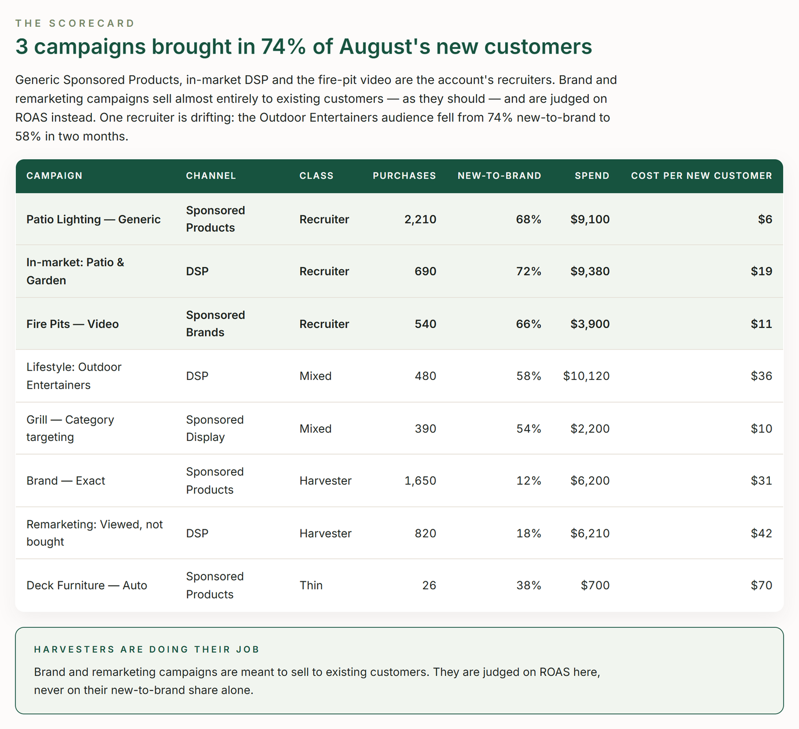

# TrackIQ: Amazon AMC New-to-Brand Campaign Scorecard

A campaign-by-campaign scorecard from Amazon Marketing Cloud: which campaigns recruit customers who have not bought from the brand in a year, and which mostly harvest people who already do. Both have a job; the scorecard makes sure each is judged on the right one.

Run it monthly, after AMC has settled the previous month.

Part of **Amazon AMC & DSP** in the
[TrackIQ skills catalog](https://github.com/TrackIQ-HQ/amazon-seller-skills).

Built as an [Agent Skill](https://code.claude.com/docs/en/skills). Runs in
Claude Code, Claude web, Claude desktop and ChatGPT from the same folder.

---

## Powered by the TrackIQ MCP

[](https://trackiq.com/mcp)

This skill reads your live Amazon account through the
**[TrackIQ MCP](https://trackiq.com/mcp)** — 16 tools connecting your AI
assistant to Amazon data:

Sales & Traffic · Orders · Inventory · Returns · Sponsored Products · Sponsored
Brands · Sponsored Display · Amazon DSP · AMC Cloud · Keywords · Search Terms ·
Targeting · Search Query Performance · Organic Rank · Best Seller Rank · Buy Box
History · Brand Analytics · Export

Works with Claude, ChatGPT and Cursor. **[Get access →](https://trackiq.com/mcp)**

---

## What you get



Ranks every campaign Amazon Marketing Cloud can see — Sponsored Products, Sponsored Brands, Sponsored Display and DSP — by how many of its purchases came from new-to-brand customers, month over month, and where the campaign's spend can be matched, what each new customer cost; so the campaigns that recruit are funded and the ones that only harvest repeat buyers are named. Use when the user asks about new-to-brand by campaign, which campaigns bring in new customers, cost per new customer by campaign, acquisition versus retention campaigns, recruiting versus harvesting, or an NTB campaign scorecard.

### The rules that keep it honest

- **One month per get_amc_ntb_purchases call, and check the row count**
- **AMC's campaign_id never joins to Sponsored Ads or DSP IDs**
- **Use AMC new-to-brand for every channel**
- **A harvester is not a bad campaign**

The full list is in `SKILL.md`, and each one exists because getting it wrong
produces a confident, wrong answer rather than an obvious error.

## Requirements

- The TrackIQ MCP, for `list_marketplaces`, `get_amc_ntb_purchases`, `get_campaigns` and `get_dsp_performance`. - **AMC enabled on the account.** If the focus month returns no rows, stop and say so. - Nothing else. No filesystem or internet needed. - **Without the MCP:** works from an AMC new-to-brand-by-campaign export plus campaign spend from Campaign Manager and the DSP console.

---

## Install

### Claude Code

```
/plugin marketplace add TrackIQ-HQ/amazon-seller-skills
/plugin install trackiq-amazon-amc-ntb-campaigns@trackiq
```

### Claude web, desktop, mobile

1. Download the `.zip` from the
   [latest release](https://github.com/TrackIQ-HQ/trackiq-amazon-amc-ntb-campaigns/releases)
2. **Settings → Capabilities → Skills** (code execution must be on)
3. **Create skill → Upload a skill**, choose the `.zip`
4. Toggle it on

### ChatGPT

Same zip. **Plugins → Skills → Create → Upload from your computer.**

---

## Setup

Answers live in `account.md`, copied from
[`assets/account.example.md`](skills/trackiq-amazon-amc-ntb-campaigns/assets/account.example.md).
**Every TrackIQ skill reads the same file**, so an account already set up for
another TrackIQ report needs nothing added.

## Delivery

Asked once and stored in `account.md`: **in-chat** (default), **file**,
**Slack**, **n8n** or **email**. Anything leaving the chat confirms with you
first and falls back to in-chat, with a note.

---

## Customizing

| File | What it controls |
|---|---|
| `checks.md` | the pre-send checks |
| `method.md` | the method and every threshold |
| `pulls.md` | the call sequence and its traps |
| `report-template.html` | the report shell |

---

## Contributing

```bash
python scripts/validate.py    # must exit 0 before any commit
python scripts/build.py       # writes dist/ zip + registry.json
```

Read [AUTHORING.md](https://github.com/TrackIQ-HQ/amazon-seller-skills/blob/main/AUTHORING.md)
before proposing changes.

## License

MIT. See [LICENSE](LICENSE).
